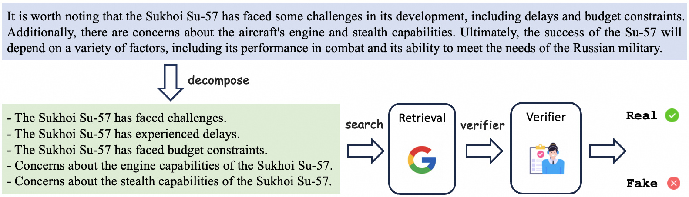

# Dis-information Detection

This project is a dis-information detection that processes datasets to extract, search, and detect dis-information. 

It is build based on [Decomp_Dilemmas](https://github.com/qishenghu/Decomp_Dilemmas). Many thanks to their work! 

The whole pipeline is shown as follow:




## Installation

Ensure you have Python3 installed. You will also need to set up the required environment variables and install necessary dependencies.

1. Clone the repository:
   ```bash
   git clone <repository-url>
   cd <repository-directory>
   ```

2. Install dependencies:
   ```bash
   pip install -r requirements.txt
   ```

## Usage

The pipeline consists of several stages: extraction, searching, verification, and evaluation. You can run these stages using the `pipeline_nli.py` script.

The following is an example script.

```bash
export SERPER_KEY_PRIVATE="your-serper-key"
export OPENAI_API_BASE="https://api.shubiaobiao.cn/v1"
export OPENAI_API_KEY="your-openai-api-key"

INPUT="./fact_checking_dataset/fact_checking_dataset_2017.jsonl"
OUTPUT="./fact_checking_dataset/fact_checking_dataset_2017.json"

# extraction -> searching -> verification -> evaluation

python3 src/pipeline_nli.py \
    --input_file $INPUT \
    --output_file $OUTPUT \
    --model_name_extraction "gpt-4o" \
    --model_name_verification "gpt-4o-mini" \
    --decompose_method "specified_number" \
    --specified_number_of_claims 8 \
    --label_n 2 \
    --stage "extraction"

python3 src/pipeline_nli.py \
    --input_file $OUTPUT \
    --output_file $OUTPUT \
    --model_name_extraction "gpt-4o" \
    --model_name_verification "gpt-4o-mini" \
    --decompose_method "specified_number" \
    --specified_number_of_claims 8 \
    --label_n 2 \
    --stage "searching"

python3 src/pipeline_nli.py \
    --input_file $OUTPUT \
    --output_file $OUTPUT \
    --model_name_extraction "gpt-4o" \
    --model_name_verification "gpt-4o-mini" \
    --decompose_method "specified_number" \
    --specified_number_of_claims 8 \
    --label_n 2 \
    --stage "verification"

python3 src/pipeline_nli.py \
    --input_file $OUTPUT \
    --output_file $OUTPUT \
    --model_name_extraction "gpt-4o" \
    --model_name_verification "gpt-4o-mini" \
    --decompose_method "specified_number" \
    --specified_number_of_claims 8 \
    --label_n 2 \
    --stage "evaluation"

```

## Contributing

Contributions are welcome! Please fork the repository and submit a pull request.

## License

This project is licensed under the MIT License.
